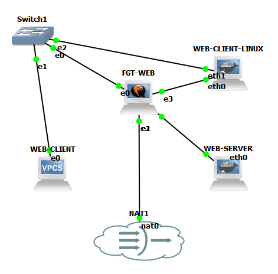
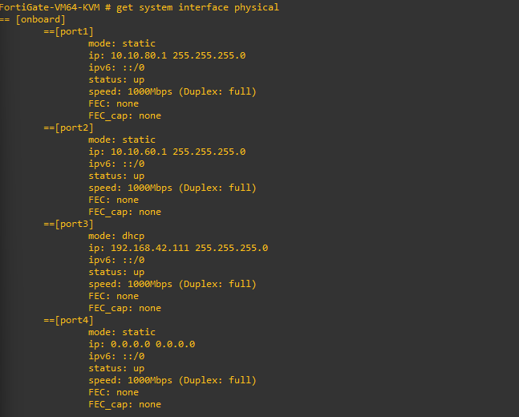
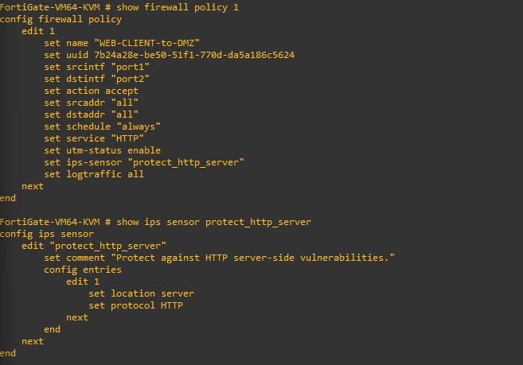
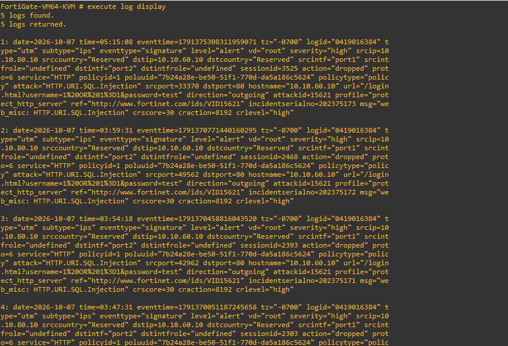
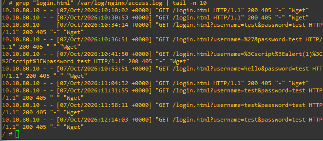
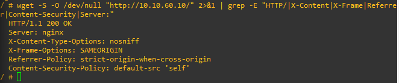

# Web Application Security Lab

A controlled web application security lab built using **GNS3**, **FortiGate**, **Alpine Linux**, and **Nginx**. The lab demonstrates how a firewall can control traffic between a client network and a DMZ-hosted web server while providing a controlled environment for security testing and traffic analysis.

## Project Information

| Item           | Details                                                           |
| -------------- | ----------------------------------------------------------------- |
| Project Type   | Cybersecurity / Network Security Lab                              |
| Environment    | GNS3                                                              |
| Firewall       | FortiGate VM64-KVM                                                |
| Web Server     | Alpine Linux                                                      |
| Web Service    | Nginx                                                             |
| Protocol       | HTTP                                                              |
| Client Network | 10.10.80.0/24                                                     |
| DMZ Network    | 10.10.60.0/24                                                     |
| Status         | Functional lab topology with controlled security-testing workflow |

---

## 1. Project Overview

The objective of this project is to build a small but realistic web application security environment in GNS3.

The lab places a web server inside a DMZ network and uses a FortiGate firewall to control communication between the client network, the DMZ, and the external network.

The environment is also used to generate controlled web traffic and observe security-related events through FortiGate and Nginx logging.

The project focuses on practical understanding of:

* Network segmentation
* Firewall policy configuration
* DMZ architecture
* Web server deployment
* HTTP traffic
* Security headers
* IPS/security monitoring
* Web-server logging
* Controlled security testing
* Evidence collection
* Git-based project documentation

---

## 2. Lab Architecture

The main GNS3 topology consists of a client network, FortiGate firewall, DMZ network, and an Alpine Linux web server.

```text
                    Internet / NAT
                         |
                         |
                    FortiGate
                   VM64-KVM
              +----------+----------+
              |                     |
           port1                   port2
              |                     |
      10.10.80.0/24          10.10.60.0/24
         Client LAN               DMZ
              |                     |
        WEB-CLIENT             WEB-SERVER
        10.10.80.10            10.10.60.10
                                    |
                                  Nginx
                                   :80
```

The topology screenshot provides visual evidence of the actual GNS3 lab configuration:



---

## 3. IP Addressing

| Device / Interface | IP Address     | Network       | Role           |
| ------------------ | -------------- | ------------- | -------------- |
| FortiGate port1    | 10.10.80.1/24  | 10.10.80.0/24 | Client gateway |
| FortiGate port2    | 10.10.60.1/24  | 10.10.60.0/24 | DMZ gateway    |
| WEB-CLIENT         | 10.10.80.10/24 | 10.10.80.0/24 | Client         |
| WEB-SERVER         | 10.10.60.10/24 | 10.10.60.0/24 | Web server     |

The separation between `10.10.80.0/24` and `10.10.60.0/24` demonstrates the use of network segmentation between the client network and the DMZ.

---

## 4. Technologies Used

### GNS3

Used to create and simulate the complete network topology.

### FortiGate

Used as the main security device for:

* Firewall policies
* Network segmentation
* Traffic control
* NAT
* IPS/security monitoring
* Security logging

### Alpine Linux

Used as the lightweight operating system for the web server.

### Nginx

Used to provide the HTTP web service inside the DMZ.

### Git and GitHub

Used for version control, project documentation, configuration evidence, and lab screenshots.

---

## 5. FortiGate Configuration

The FortiGate firewall separates the client network from the web-server DMZ.

### 5.1 Client-to-DMZ Policy

The main client-to-server policy allows traffic from:

```text
10.10.80.0/24
```

to:

```text
10.10.60.0/24
```

The policy is named:

```text
WEB-CLIENT-to-DMZ
```

The policy is configured without source NAT because the DMZ server should see the original client address.

### 5.2 Server-to-Internet Policy

The web server requires controlled external connectivity for activities such as package installation and updates.

The policy:

```text
WEB-SERVER-to-Internet
```

allows traffic from the DMZ interface toward the external interface with NAT enabled.

### FortiGate Interface Evidence

The following screenshot shows the relevant FortiGate interfaces used by the lab:



### Firewall and IPS Configuration Evidence

The following screenshot shows the configured policy and security/IPS-related settings:



---

## 6. Web Server

The web server runs Alpine Linux with Nginx.

The server uses:

```text
IP Address: 10.10.60.10
Subnet:     255.255.255.0
Gateway:    10.10.60.1
Service:    Nginx
Port:       80
Protocol:   HTTP
```

Nginx was configured to serve the web application content from the Alpine Linux server.

---

## 7. Connectivity Validation

Basic connectivity was tested between the client, FortiGate, and web server.

The following tests were successfully established during the lab:

```text
WEB-CLIENT
    |
    | ICMP
    v
FortiGate port1
    |
    | Firewall policy
    v
FortiGate port2
    |
    | ICMP / HTTP
    v
WEB-SERVER
```

HTTP connectivity to the web server was also verified.

The FortiGate was able to establish a TCP connection to the web server on port 80, and the client was able to retrieve the web page from Nginx.

---

## 8. Lab Evidence and Screenshots

This section contains screenshots captured during the construction, configuration, and testing of the lab.

### 8.1 GNS3 Topology

The following screenshot shows the overall GNS3 security-lab topology and how the devices are connected.


### 8.2 FortiGate Interfaces

This screenshot provides evidence of the FortiGate interfaces used for the client and DMZ networks.


### 8.3 Firewall Policy and IPS

This screenshot provides evidence of the firewall policy and IPS/security configuration used in the lab.


### 8.4 IPS Logs

The following screenshot provides evidence of security events/log information observed during the testing process.



### 8.5 Web Server Logs

The following screenshot shows logging evidence from the web server.



### 8.6 Security Header Test

The following screenshot provides evidence from the controlled web security testing performed against the lab web application.



---

## 9. Web Traffic and Logging

Web requests generated during testing were recorded by the Nginx web server.

Nginx access logs provide information such as:

* Client IP address
* Request time
* HTTP method
* Requested URL
* HTTP status code
* Response size
* User-agent information

Example log location:

```text
/var/log/nginx/access.log
```

These logs provide useful evidence when investigating normal and suspicious HTTP requests.

The captured web-server log is included in:

```text
screenshots/web-server/web_server_log.png
```

---

## 10. Security Testing Methodology

The lab is designed for **controlled security testing** rather than attacking real systems.

### Test 1 — Normal HTTP Request

A normal request is sent from the client toward the web server.

Example:

```text
GET /
```

The expected result is a successful HTTP response from Nginx.

The request should also appear in the Nginx access log.

### Test 2 — Controlled Suspicious HTTP Input

A harmless suspicious-looking HTTP request can be generated to observe how the web server and security controls handle unusual input.

Example:

```text
GET /?id=' OR '1'='1
```

The purpose is **observation and detection**, not exploitation.

The resulting request can be examined in:

* Nginx access logs
* FortiGate security logs
* IPS/security monitoring

No real external target is involved.

---

## 11. Security Principles Demonstrated

The lab demonstrates several practical cybersecurity concepts.

### Network Segmentation

The client and web server are placed on different networks:

```text
10.10.80.0/24
10.10.60.0/24
```

This prevents direct Layer-2 communication and forces traffic through the FortiGate firewall.

### Firewall Policy Enforcement

Traffic between the client and DMZ is controlled by an explicit FortiGate policy.

### DMZ Architecture

The web server is separated from the client network and placed in a dedicated DMZ.

### Least-Privilege Access

Only the traffic required for the lab is allowed through the firewall policies.

### Security Monitoring

FortiGate security events and Nginx logs provide visibility into traffic and security-related activity.

### Controlled Testing

Security tests are performed only against the intentionally created lab environment.

---

## 12. Repository Structure

```text
web-application-security-lab/
│
├── Web_App_Security_Lab.gns3
├── README.md
├── .gitignore
│
├── screenshots/
│   ├── topology/
│   │   └── security_lab.png
│   │
│   ├── fortigate/
│   │   ├── ips_logs.png
│   │   ├── policy_ips.png
│   │   └── port1_port2.png
│   │
│   ├── web-server/
│   │   └── web_server_log.png
│   │
│   └── tests/
│       └── security_header.png
│
├── documentation/
├── fortigate/
├── nginx/
└── tests/
```

The `project-files/` directory contains GNS3 runtime files and is excluded from Git using `.gitignore`.

---

## 13. Why GNS3?

GNS3 provides a useful environment for building and testing network-security scenarios without requiring physical networking equipment.

For this project, GNS3 makes it possible to combine:

* FortiGate
* Alpine Linux
* Nginx
* Virtual client systems
* NAT/Internet connectivity

This provides a practical environment for experimenting with network segmentation, firewall policies, web traffic, and security monitoring.

---

## 14. Future Improvements

Possible future improvements include:

* HTTPS/TLS configuration
* Web application authentication
* Additional security headers
* Web Application Firewall functionality
* More detailed FortiGate IPS testing
* HTTP/HTTPS traffic comparison
* Centralized logging
* SIEM integration
* Additional controlled security tests
* Automated security testing
* Database-backed web application
* More detailed incident-analysis scenarios

---

## 15. Security and Ethical Use

This project is intended strictly for educational and authorized security testing.

All security tests should be performed only against systems owned by the tester or systems for which explicit authorization has been provided.

The lab provides an isolated environment for learning about:

* Web application security
* Firewall configuration
* Network segmentation
* Intrusion prevention
* Security monitoring
* Log analysis

---

## 16. Current Project Status

### Completed

* GNS3 topology created
* FortiGate deployed
* Client network configured
* DMZ/server network configured
* Alpine Linux web server deployed
* Nginx installed and configured
* HTTP connectivity established
* FortiGate client-to-DMZ policy configured
* FortiGate server-to-Internet policy configured
* Basic web traffic generated
* Security-related testing performed in the controlled environment
* Screenshots and security evidence collected
* Git repository initialized
* Initial project files committed
* Project documentation created
* Lab screenshots added to the repository
* Project pushed to GitHub

### In Progress

* Formalize detailed security-test results
* Add additional screenshots where necessary
* Document detailed FortiGate configuration
* Analyze Nginx logs
* Perform additional controlled security tests
* Add final conclusions and observations

---

## 17. Project Learning Outcomes

Through this project, practical experience was gained in:

* Building a virtual cybersecurity lab
* Configuring FortiGate interfaces
* Designing firewall policies
* Implementing network segmentation
* Creating a DMZ environment
* Deploying an Alpine Linux web server
* Configuring Nginx
* Generating and analyzing HTTP traffic
* Reading web-server logs
* Observing security events
* Performing controlled security testing
* Collecting technical evidence
* Using Git for version control
* Documenting a cybersecurity project

---

## 18. Author

**Meleng Collins**

Cybersecurity / IT Internship Project

**Project:** Web Application Security Lab

**Environment:** GNS3 + FortiGate + Alpine Linux + Nginx
